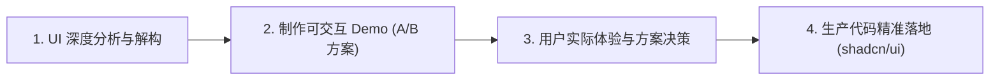

# Product Design & Interactive Prototyping Workflow (产品设计与交互原型规范)

This skill guides the design, evaluation, and interactive prototyping of all user interface (UI) and user experience (UX) modifications.

> [!IMPORTANT]
> **Core Rule**: NEVER jump straight into modifying production frontend code (`.tsx`, `.css`) when handling UI redesigns or new interface features. Always follow the 4-phase design-first workflow.

---

## 4-Phase Design Workflow (四阶段设计工作流)

### Phase 1: Deep UI Analysis (需求与交互深度分析)
Before proposing any visuals:
1. **Analyze Current State**: What UI elements currently exist? What is their information density? What pain points do users experience?
2. **Evaluate Necessity**: Identify what is critical, what is redundant/noise, and what can be consolidated.
3. **Component Architecture**: Plan which standardized `shadcn/ui` primitives (`Button`, `Card`, `Badge`, `Progress`, `Tooltip`, `Dialog`, `DropdownMenu`, etc.) and Tailwind CSS utilities will be composed.

### Phase 2: Interactive Prototyping (构建可体验的交互 Demo)
Leverage the `generative_ui` capability to construct self-contained, live, interactive HTML prototypes:
1. **Multiple Distinct Options**: Provide at least 2 clear design directions (e.g., **方案 A：高密紧凑风 (Compact Pro)** vs **方案 B：现代卡片微动效风 (Modern Fluid)**).
2. **True Interactivity**: Demos must not be static mockups. Buttons must click, tabs must switch, filters must toggle, and state must update interactively so the user can literally test the UX in their browser or chat embed.
3. **Artifact Generation**:
   - Write `.html` files to the conversation artifact directory using `write_to_file`.
   - Include Tailwind CSS: ``.
   - Embed inline via `<agent-embed src="file:///..."></agent-embed>` or provide direct standalone preview links.

### Phase 3: User Experience & Selection (用户亲身体验与方案选择)
1. Present the prototype directly to the user with an interactive demo switcher or side-by-side comparison.
2. Outline the trade-offs, advantages, and ergonomic benefits of each option.
3. Wait for the user to try the demo, provide feedback, or pick their preferred choice.

### Phase 4: Production Implementation (生产代码落地与门禁自检)
Only after the user approves a specific design:
1. Implement the chosen design cleanly into React/Tailwind codebase using `@/components/ui/*`.
2. Follow strict code quality: zero dead code, zero inline ad-hoc elements.
3. Verify with `npm run build` and `cargo check`.
