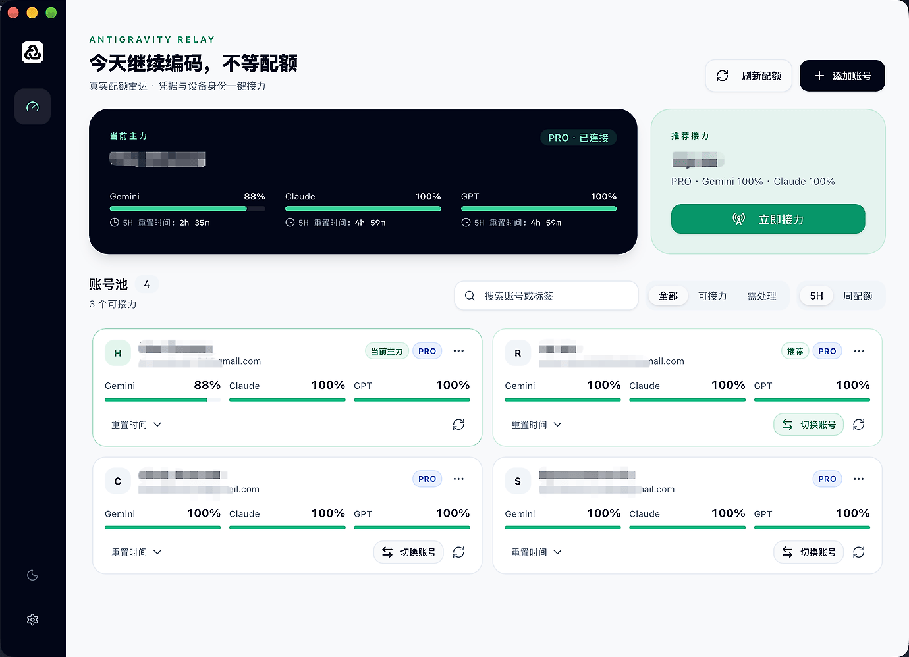

<div align="center">
  
  <h1>AMT</h1>
  <p><strong>Multi-account quota and relay manager for Antigravity</strong></p>
  <p>Know your quotas. Switch accounts. Stay focused.</p>
  <p>
    <a href="https://github.com/wuyunfeng8/Antigravity-Manager/releases"></a>
    
    <a href="LICENSE"></a>
  </p>
  <p><a href="README.md">简体中文</a> · <strong>English</strong></p>
  <p><a href="https://github.com/wuyunfeng8/Antigravity-Manager/releases">Download</a> · <a href="CHANGELOG.md">Changelog</a> · <a href="https://github.com/wuyunfeng8/Antigravity-Manager/issues">Feedback</a></p>
</div>



## Features

- **Quotas at a glance** — Remaining capacity, reset times, and account health, with 5-hour and weekly views.
- **One-click relay** — Find an available account and switch the Antigravity desktop app with fewer sign-in interruptions.
- **Device identities** — Bind identities to accounts, manage history, and restore saved baselines.
- **Always within reach** — System tray, compact view, background refresh, and weekly quota warmup. English and Simplified Chinese.

## Installation

Download a `.dmg` from [Releases](https://github.com/wuyunfeng8/Antigravity-Manager/releases): `aarch64` for Apple Silicon or `x64` for Intel. Version 1.1.0 provides macOS packages only.

Or install with Homebrew:

```bash
brew tap wuyunfeng8/antigravity-manager https://github.com/wuyunfeng8/Antigravity-Manager
brew install --cask antigravity-tools
```

> Version 1.1.0 is not Apple Developer ID signed or notarized. If macOS blocks the first launch, verify the source and release `SHA256SUMS`, then follow [Apple’s instructions](https://support.apple.com/en-us/102445) to select **Open Anyway**.

## Getting started

1. Install and launch the Antigravity desktop app once.
2. Add accounts in AMT using Google OAuth. Refresh-token and database imports are also supported.
3. Check quotas, then use the recommended account or switch manually. Switching restarts the client, so save your work first.

Account data stays locally in `~/.antigravity_tools`; move it from Settings if needed. Exports contain refresh tokens—keep them private. Quotas depend on service responses; device identity isolation does not guarantee account safety or platform risk-control outcomes.

## Development

Built with **Tauri 2 · Rust · React · TypeScript · shadcn/ui**. Requires Node.js 22 (22.12+), Rust stable, and platform build tools. On macOS, install Xcode Command Line Tools.

```bash
git clone https://github.com/wuyunfeng8/Antigravity-Manager.git
cd Antigravity-Manager
npm ci --legacy-peer-deps
npm run tauri dev
```

See [AGENTS.md](AGENTS.md) for development and validation guidelines (Chinese).

## License & acknowledgments

[MIT](LICENSE) · Independently developed with reference to [lbjlaq/Antigravity-Manager](https://github.com/lbjlaq/Antigravity-Manager). Thanks to the original project and the [LINUX DO](https://linux.do/) community.
